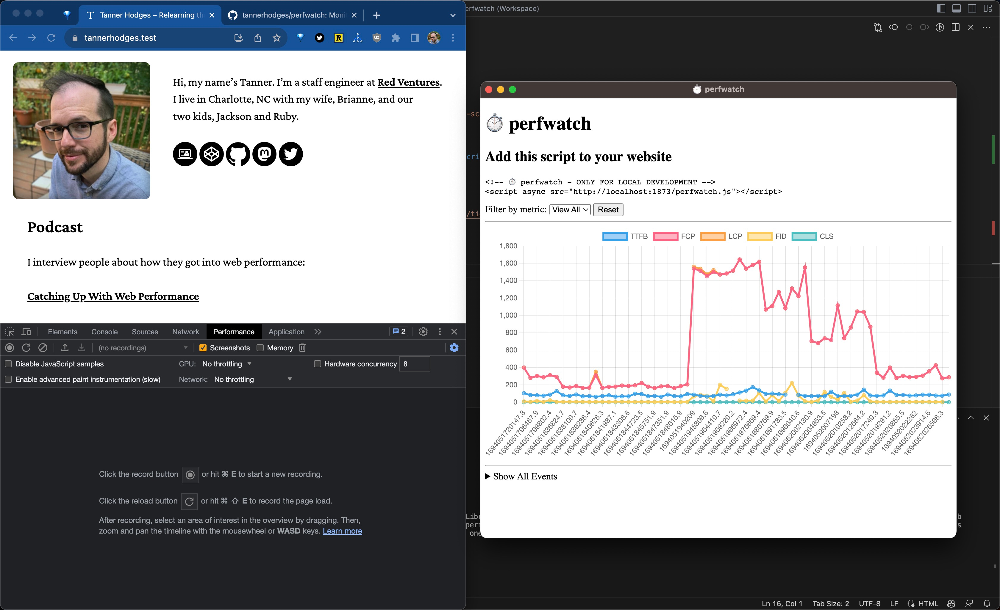

# ⏱️ perfwatch

App for watching performance changes during local development.

```sh
npm install
npm start
```

```html
<!-- ⏱️ perfwatch - ONLY FOR LOCAL DEVELOPMENT -->
<script async src="http://localhost:1873/perfwatch.js"></script>
```



## Notes

- Built with Electron. https://www.electronjs.org/docs/latest/tutorial/quick-start

## TODOs

- [ ] Get file diffs.
- [ ] Annotate timeline with file diffs.
- [ ] Keep logs for different sites separate. I.e., switch between multiple projects.
- [ ] Notify when metrics change significantly.
- [ ] Compare timeline ranges.
- [ ] Detect environment settings (e.g., device and connection speed).
- [ ] Document adblockers blocking cross-origin beacons to http://localhost:1873.
- [ ] Troubleshoot custom service worker throwing `The FetchEvent for "http://localhost:1873/perfwatch.js" resulted in a network error response: an object that was not a Response was passed to respondWith().`
