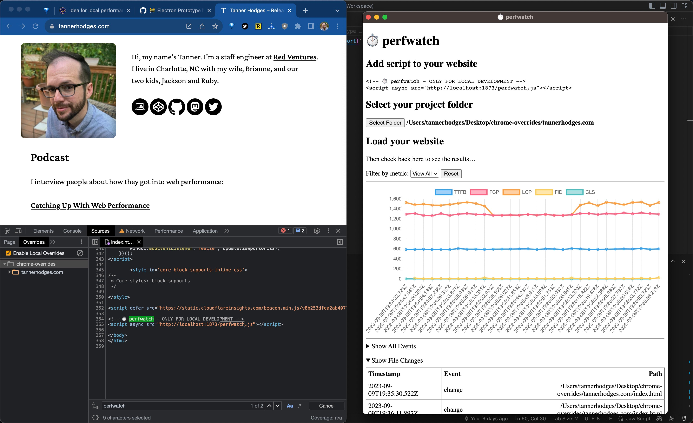

# ⏱️ perfwatch

App for watching performance changes during local development.

```sh
npm install
npm start
```

<!-- prettier-ignore -->
```html
<!-- ⏱️ perfwatch - ONLY FOR LOCAL DEVELOPMENT -->
<script>window.exports = window.exports || {}</script>
<script type="module" src="http://localhost:1873/perfwatch.js"></script>
```



## Distributing

For test builds:

```sh
npm run package
```

For sharing with everyone else:

```sh
npm run make
```

## Troubleshooting

We use [debug](https://github.com/debug-js/debug#readme) for logging debug messages.

To debug perfwatch during development:

```sh
DEBUG=perfwatch npm run start
```

To debug the entire app build process:

```sh
DEBUG=* npm run package
DEBUG=* npm run make
```

## TODOs

- [x] Get file diffs.
- [ ] Annotate timeline with file diffs.
- [ ] Keep logs for different sites separate. I.e., switch between multiple projects.
- [ ] Notify when metrics change significantly.
- [ ] Add error notifications.
- [ ] Compare timeline ranges.
- [ ] Detect environment settings (e.g., device and connection speed).
- [ ] Document adblockers blocking cross-origin beacons to http://localhost:1873.
  - uBlock Origin → Settings → My filters → `@@||localhost:1873^`
- [ ] Troubleshoot custom service worker throwing `The FetchEvent for "http://localhost:1873/perfwatch.js" resulted in a network error response: an object that was not a Response was passed to respondWith().`

## Built With

- [Electron](https://www.electronjs.org/docs/latest/tutorial/quick-start)
- [Electron Forge](https://www.electronforge.io/templates/vite-+-typescript)
- [TypeScript](https://www.typescriptlang.org/)
- [Vite](https://vitejs.dev/)
- [web-vitals](https://github.com/GoogleChrome/web-vitals#readme)
- [chart.js](https://www.chartjs.org/)
